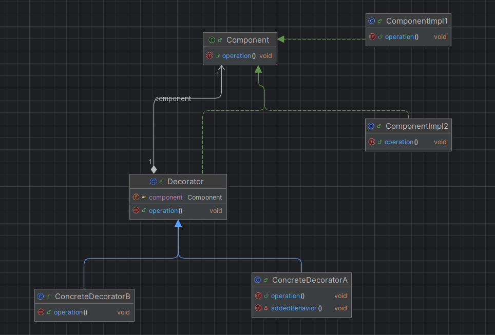

# Design Pattern : Décorateur (Decorator)

Le **design pattern Décorateur** (Decorator) est un patron de conception structurel qui permet d'ajouter dynamiquement 
de nouvelles responsabilités à un objet sans modifier son code. Il est souvent utilisé comme une alternative à l'héritage
pour étendre les fonctionnalités des classes.

---

## Diagramme de classe UML

---

## Explication du design pattern Décorateur

1. **Problème** : Vous avez une classe avec des fonctionnalités de base et vous souhaitez ajouter des fonctionnalités supplémentaires de manière flexible, sans toucher à la classe initiale ou créer un grand nombre de sous-classes.
2. **Solution** : Utilisez des objets décorateurs qui enveloppent l'objet initial et ajoutent de nouvelles fonctionnalités.

---

## Avantages du pattern Décorateur

1. **Flexibilité** : Ajout dynamique de fonctionnalités à un objet.
2. **Évite un grand nombre de sous-classes** : Pas besoin de créer des sous-classes pour chaque combinaison possible de fonctionnalités.
3. **Ouvert à l'extension, fermé à la modification** : Respect du principe SOLID (OCP).

## Inconvénients

1. Peut entraîner une complexité supplémentaire en raison de l'enchaînement des décorateurs.
2. Difficile à déboguer si les décorateurs sont imbriqués de manière excessive.

---

Ce pattern est particulièrement utile dans les applications où les fonctionnalités peuvent être ajoutées 
ou supprimées dynamiquement, comme les systèmes de personnalisation ou les frameworks graphiques.
